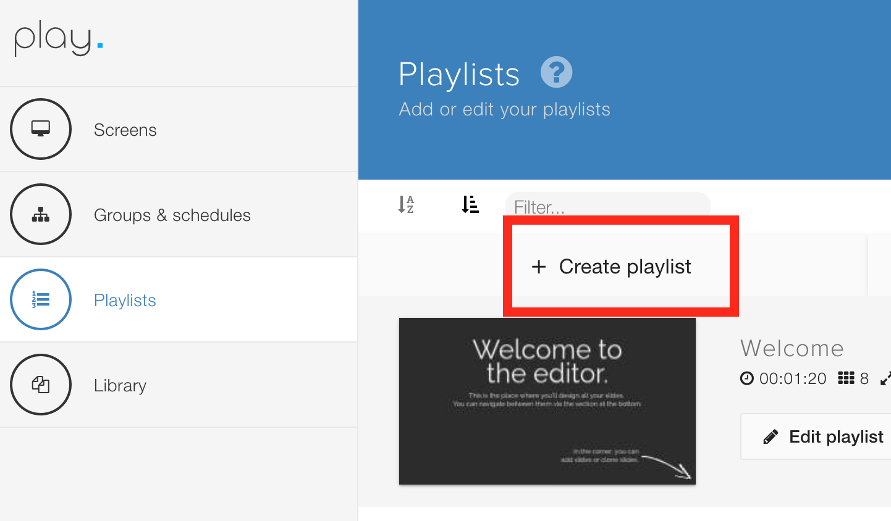
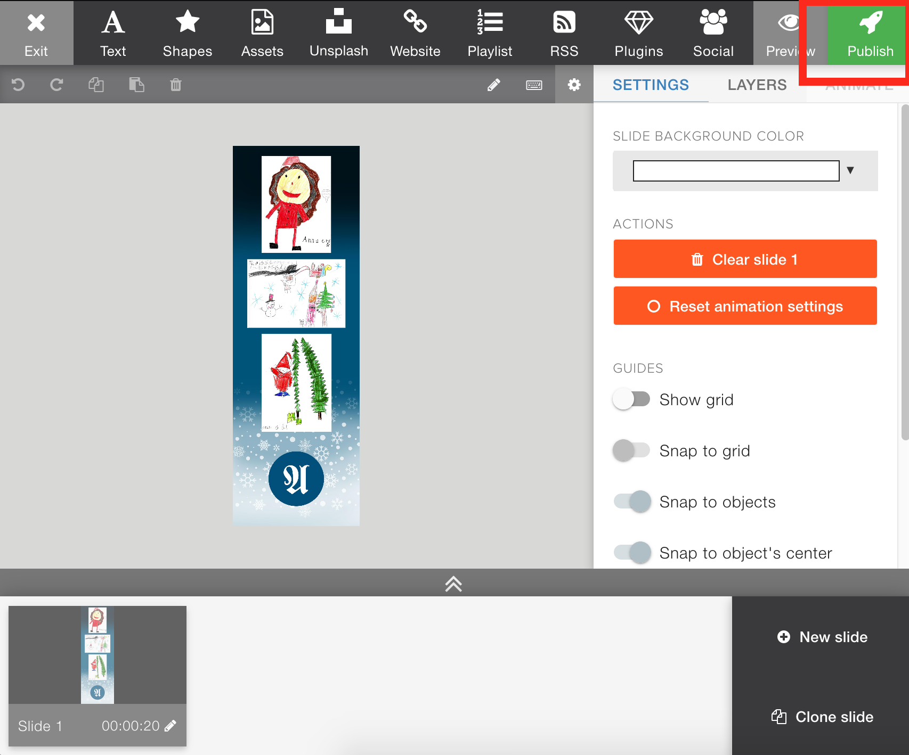

# LED display

## Specifications

| Spec | value |
| :--- | :--- |
| Pitch | P6 |
| Width | 960mm |
| Height | 2880mm |
| Enclosure size | 960 x 2880mm |
| Display size square metre \(one side\) | 2,76 m^2 |
| Resolution | 160 x 480 pixels |
| Luminous intensity | 6000nits |
| Angle of view | 160/160 degrees |
| Service | front |
| Weight screens | 260kg |
| Weight steel construction | 70kg |

## How to add content to signage solution \(playsignage\)


To see the content guide creation follow the instructions in our article [here](creating-content.md)


Official documentation: [https://playsignage.com/support/](https://playsignage.com/support/)

Go here to modify slides: [https://my.playsignage.com/manage/playlists](https://my.playsignage.com/manage/playlists)

### This is how you add a new playlist

At this point your slides are ready, but not showing anywhere. To assign to screen do the following.

You can verify what the screen is showing by entering "Screens" and request a screenshot by clicking the photo camera icon. It should return something like this:

