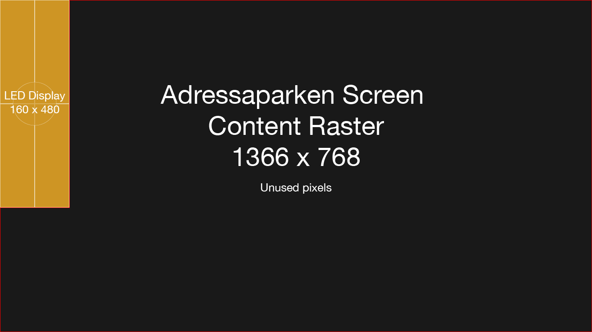
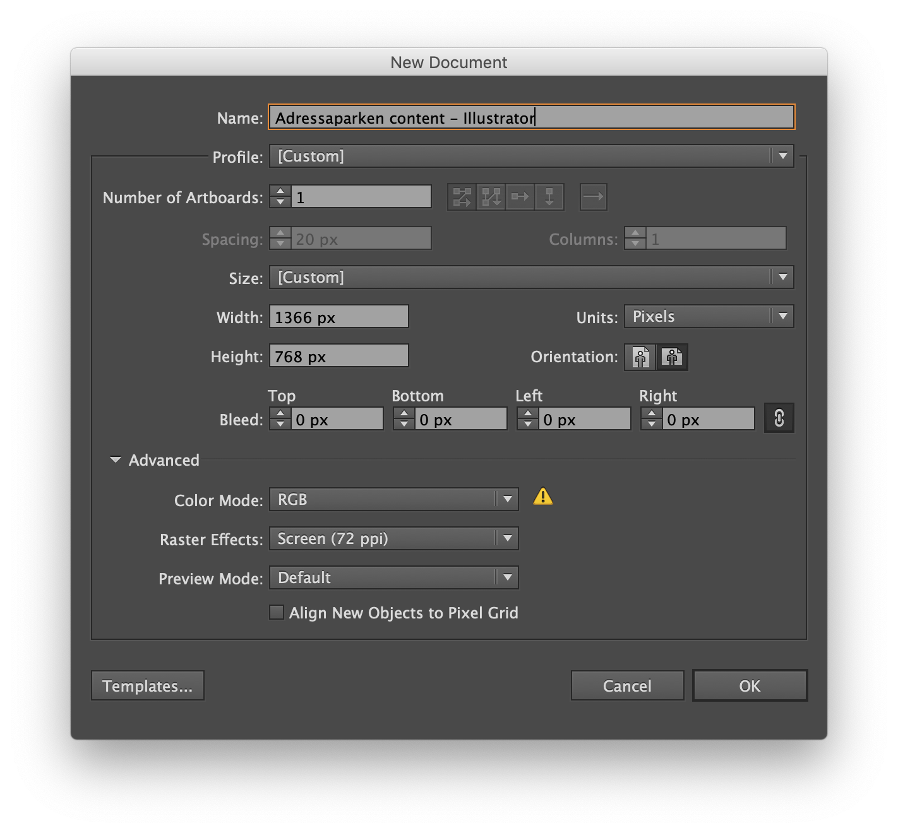
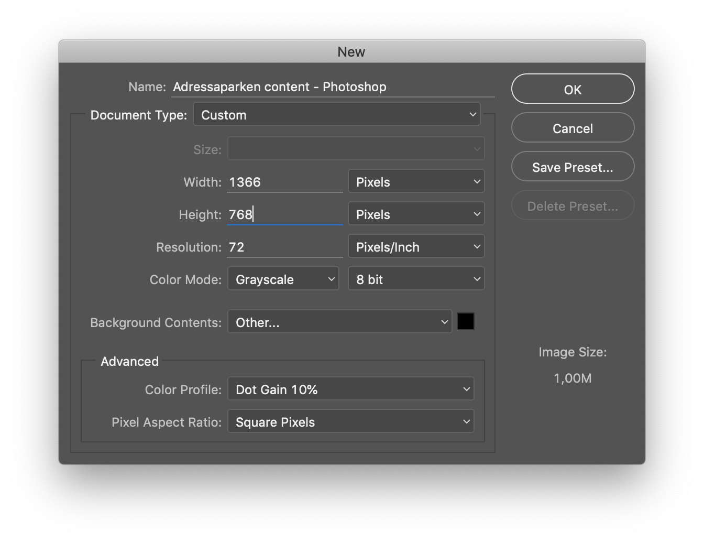

# Creating content

## Content Guide


The screen at adressaparken is connected to the Hippotizer media server on its second output.

While the screen resolution is 160 x 480, the resolution sent to the video processor is WXGA 1366 x 768.


Content for the screen can be created either pixel perfect to the screen \(160 x 480px\) or to the output resolution \(1366 x 768\), resolutions different from these will result on badly mapped content.

The installed digital signage application actively re-positions the content given to fit in the output. Meaning that as long as the application is used, the content can be created accurately concerning only the LED panel resolution \(160 x 480px\).

Download illustrator file below



To use a different application or a normal media player, it could be necessary to create content that is pixel perfect to the output \(1366 x 768px\) with the content for the screen position in the top left corner and sized correctly \(160 x 480px\).

