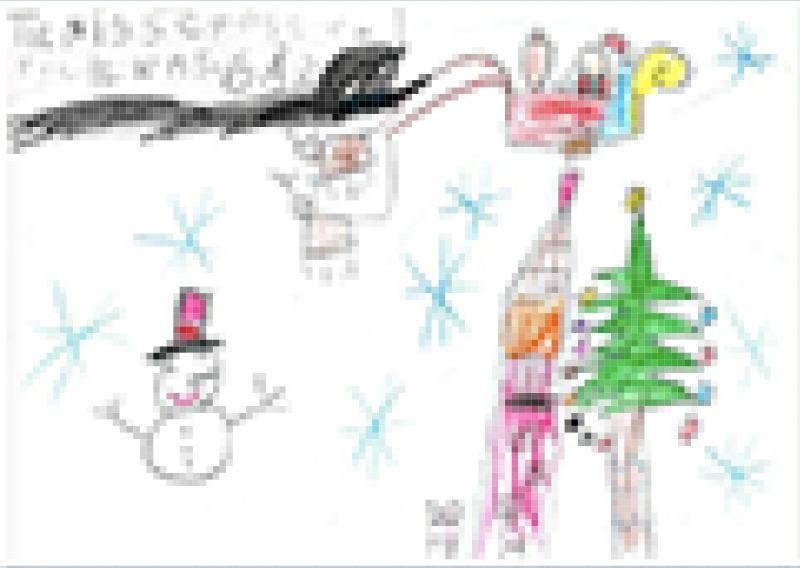
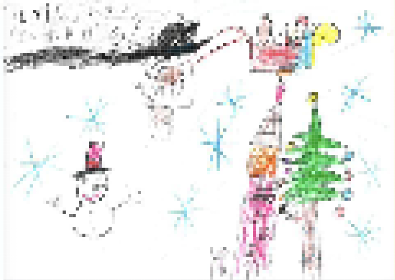

# Note on resampling algorithms

Different options on resampling algorithm inside photoshop:

Using the example of a child hand drawing, with lines from various thicknesses we can see that bilinear offers the best results, although not ideal















 

