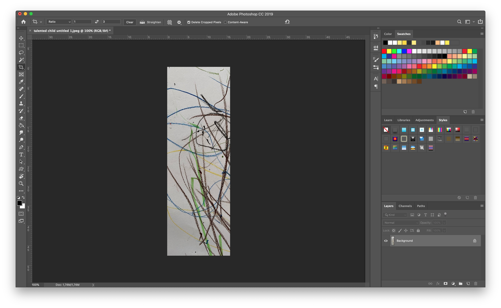
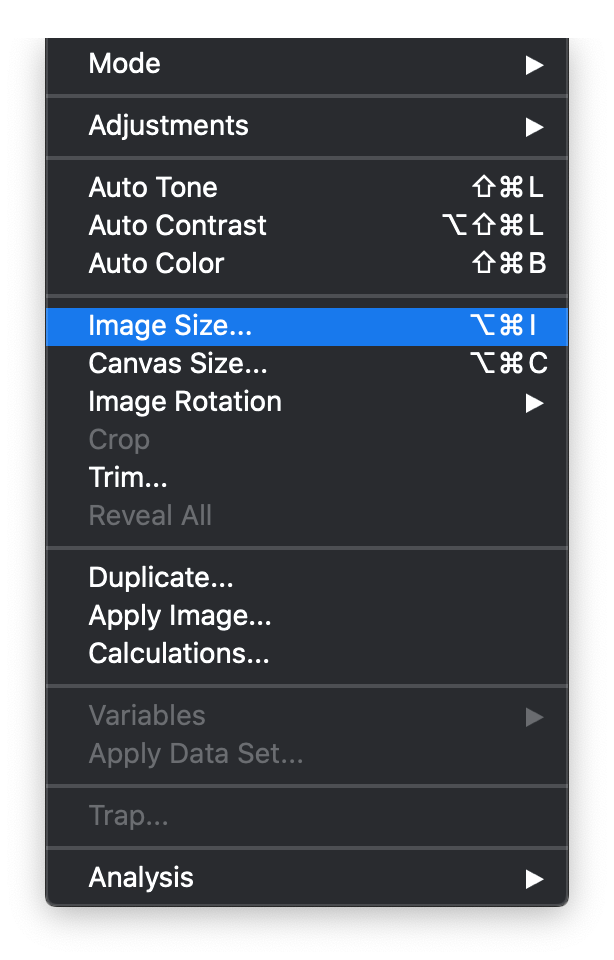
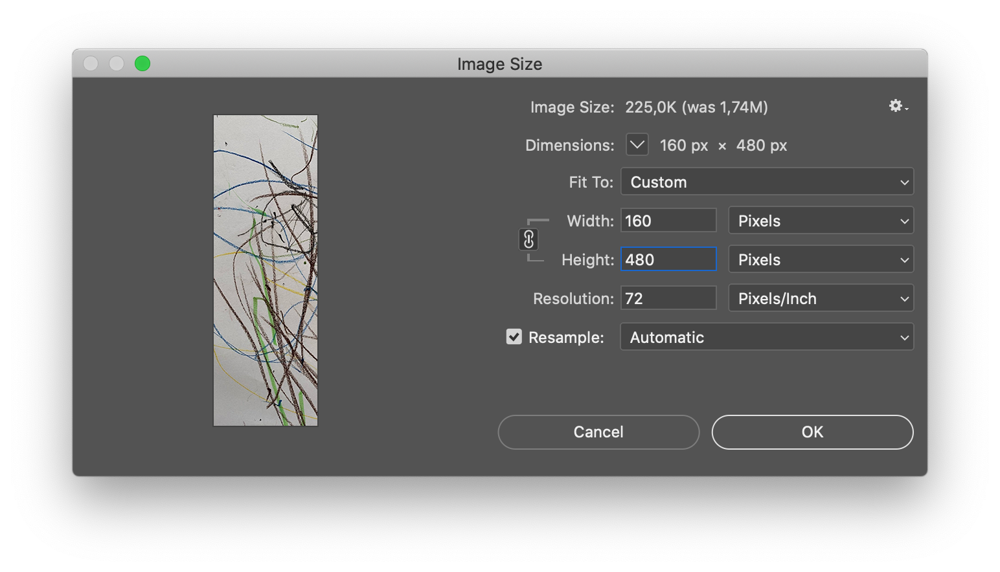
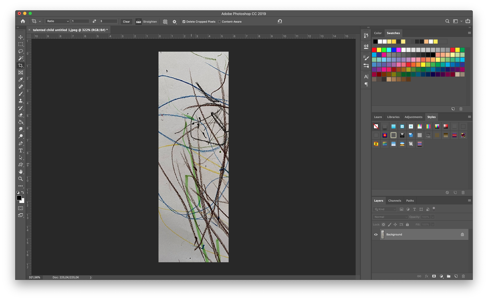

# Scale and export from Photoshop

When downscaling images in photoshop, it is worth keeping an eye on the different scaling algorithms. These will produce different results depending on the amount of scale and content type. 

The following steps would be necessary

* Import image into photoshop
* Set Crop Tool to 1 x 3 aspect \(same as LED screen\)
* Select Area of interest and crop image
* Resize image to screen resolution \(160 x 480px\)

