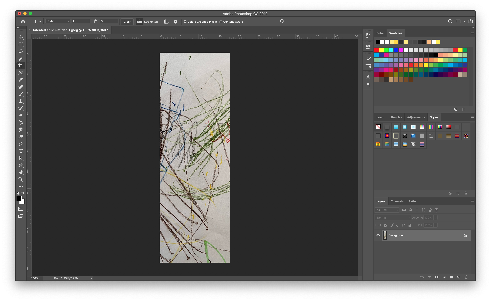
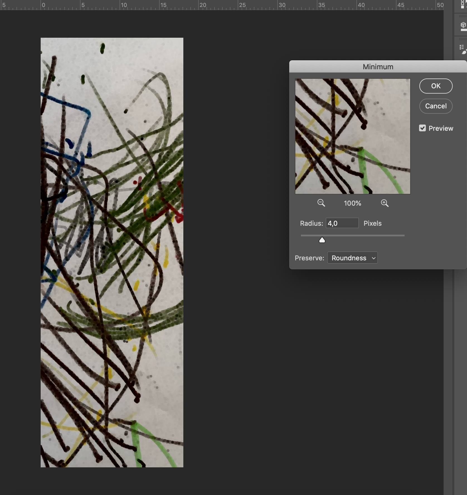
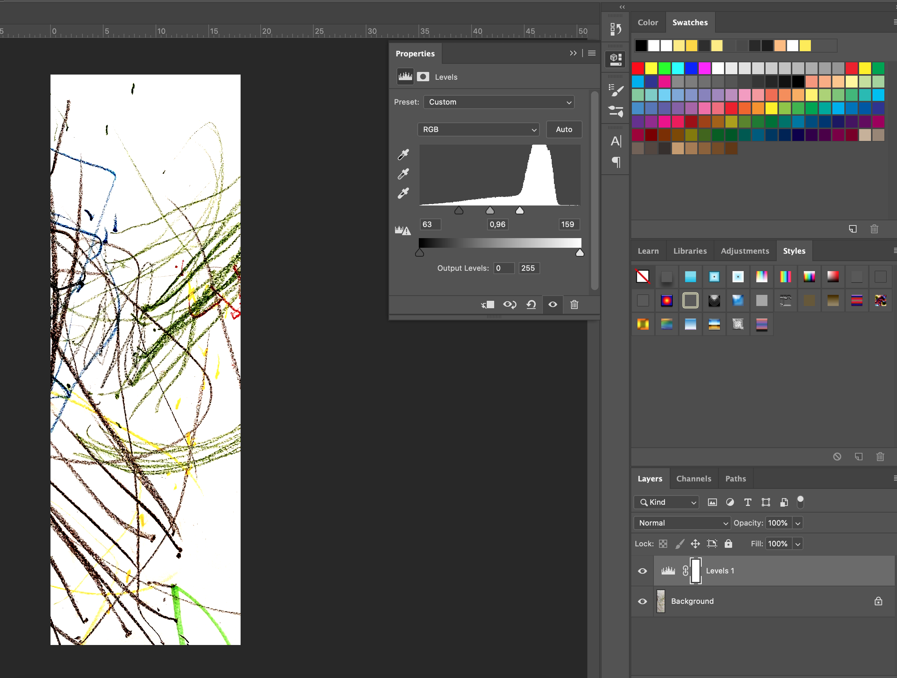

# Thicken lines


This is the "nuclear option" \(after last resort\)


In case the rescaling produces unusable content

* If possible, choose a small section of the content that works when scaled up
* Use a levels adjustment layer to increase black level and enhance back small line detail \(Image 2\)
* Try using minimum filter to make lines thicker \(Image 3\)

Further optimisation would have to be done in a case by case scenario using perhaps level and curve adjustments. The cutout filter can also be used to simplify shapes and colours.

Using Minimum filter it is possible to clamp the black values and add thickness to small details \(Filter &gt; Other &gt; Minimum\)

More subtle effect can be obtained by using a Levels Adjustment Layer to increase black level \(Ctrl + L - CMD + L\)

