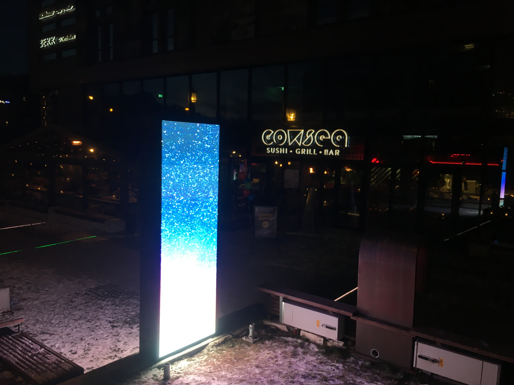

# LED display

## Specifications

| Spec | value |
| :--- | :--- |
| Pitch | P6 |
| Width | 960mm |
| Height | 2880mm |
| Enclosure size | 960 x 2880mm |
| Display size square metre \(one side\) | 2,76 m^2 |
| Resolution | 160 x 480 pixels |
| Luminous intensity | 6000nits |
| Angle of view | 160/160 degrees |
| Service | front |
| Weight screens | 260kg |
| Weight steel construction | 70kg |

## How to add content to signage solution \(playsignage\)

[https://my.playsignage.com/manage/playlists](https://my.playsignage.com/manage/playlists)

